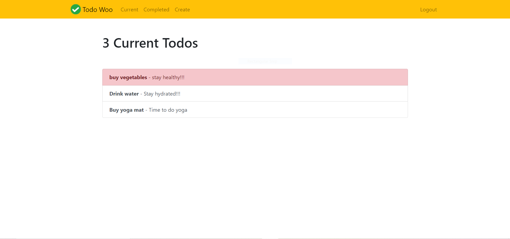
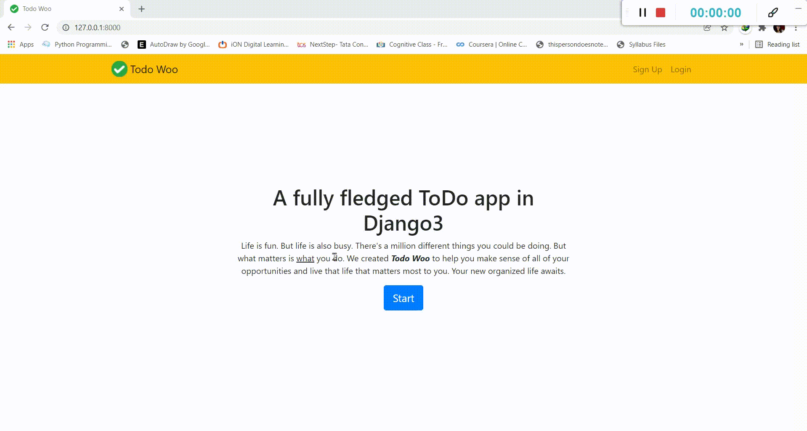

# ToDo-App-Django3
> A fully fledged website with authentication and CRUD operations, built in top of django3 framework and SQLlite

## Requirements  (Prerequisites)
* Linux or Windows
* Python 3.8 and up

For Windows

`git clone https://github.com/bhawna94110/ToDo-App-Django4.git`

## Install project dependencies:

`$ pip install -r requirements.txt`

Then simply apply the migrations:

    $ python manage.py migrate
    

You can now run the development server:

    $ python manage.py runserver

 
## Demo

## Tech Stack / Built With
1. Django4 - The python framework
2. Bootstrap4 
3. Heroku (for deployment)
## Authors

- [@Bhawana](https://www.github.com/bhawna94110)

  
## 🔗 Links

  
